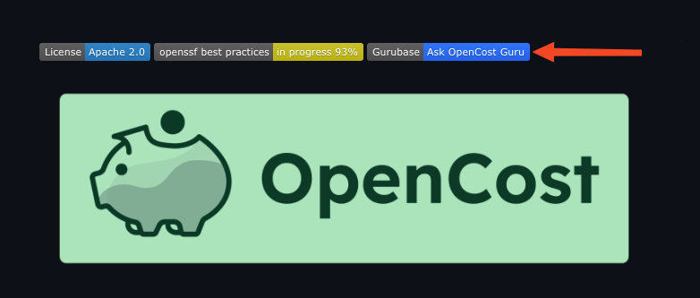
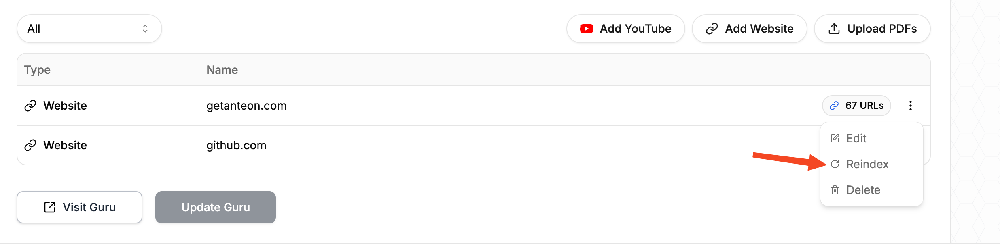
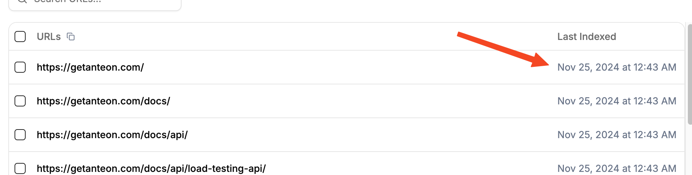

<div align="center">
    
    <br/><br />
</div>


# Gurubase - AI-powered Q&A assistants for any topic


<div align="center">

[](https://discord.gg/9CMRSQPqx6)
[](https://twitter.com/gurubaseio)
[](https://mastodon.social/@gurubaseio)
[](https://bsky.app/profile/gurubase.bsky.social)
[](https://github.com/Gurubase/gurubase/blob/master/LICENSE)
</div>

<h2 align="center">
    <a href="https://docs.gurubase.io/introduction" target="_blank">Documentation</a> •
    <a href="https://discord.gg/9CMRSQPqx6" target="_blank">Discord</a>
</h2>

- [What is Gurubase](#what-is-gurubase)
- [Features](#features)
- [Quick Install](#quick-install)
- [How to Create a Guru](#how-to-create-a-guru)
- [How to Claim a Guru](#how-to-claim-a-guru)
- [Showcase Your Guru](#showcase-your-guru)
- [How to Update Datasources](#how-to-update-datasources)
- [License](#license)
- [Help](#help)
- [Used By](#used-by)
- [Frequently Asked Questions](#frequently-asked-questions)

## What is Gurubase

[Gurubase](https://gurubase.io) is an open-source RAG system that lets you create AI-powered Q&A assistants ("Gurus") for any topic or need. Create a new Guru by adding:
- 📄 Webpages
- 📑 PDFs
- 🎥 YouTube videos
- 💻 GitHub repositories

Start asking questions directly on Gurubase, or [embed it on your website](https://github.com/Gurubase/gurubase-widget) to let your users ask questions about your product. It's already being [used by](#used-by) hundreds of open-source repositories. You can also install the entire system on your server, check [INSTALL.md](INSTALL.md) for instructions on how to self-host Gurubase.

## Features

- 🤖 **AI-Powered Q&A**: Advanced LLM-based question answering, including instant evaluation mechanism to minimize hallucination as much as possible
- 🔄 **RAG System**: Retrieval Augmented Generation for accurate, context-aware responses
- 📚 **Multiple Data Sources**: Add web pages, PDFs, videos, and GitHub repositories as data sources for your Guru.
- 🔌 **Easy Integration**: 
  - [Website Widget](https://docs.gurubase.ai/integrations/website-widget) for embedding on your site
  - [Slack Bot](https://docs.gurubase.ai/integrations/slack-bot) for asking questions in Slack
  - [Discord Bot](https://docs.gurubase.ai/integrations/discord-bot) for asking questions in Discord
- 🎯 **Custom Gurus**: Create specialized AI assistants for specific topics
- 🔄 **Real-time Updates**: Keep the data sources up to date by reindexing them with one click
- ⛬ **Binge**: Visualize your learning path while talking with a Guru. You can navigate through it and create a personalized path
- 🛠 **Self-hosted Option**: Full control over your deployment. Install the entire system on your servers

## Quick Install

If you prefer not to use [Gurubase.io](https://gurubase.io), you can install the entire system on your own servers.

```bash
curl -fsSL https://raw.githubusercontent.com/Gurubase/gurubase/refs/heads/master/gurubase.sh -o gurubase.sh
bash gurubase.sh
```

See [INSTALL.md](INSTALL.md) for detailed installation instructions and prerequisites.

## How to Create a Guru

Currently, only the Gurubase team can create a Guru on [Gurubase.io](https://gurubase.io/). Please [open an issue](https://github.com/Gurubase/gurubase/issues/new?template=guru_creation_request.md) on this repository with the title "Guru Creation Request" and include the GitHub repository link in the issue content. We prioritize Guru creation requests from the maintainers of the tools. Please mention whether you are the maintainer of the tool. If you are not the maintainer, it would be helpful to obtain the maintainer's permission before opening a creation request for the tool.

## How to Claim a Guru

Although you can't create a Guru on [Gurubase.io](https://gurubase.io/), you can manage it on Gurubase. For example, you can add, remove, or reindex the datasources. To claim a Guru, you must have a Gurubase account and be one of the tool's maintainers. Please [open an issue](https://github.com/Gurubase/gurubase/issues/new?template=guru_claim_request.md) with the title "Guru Claim Request". Include the link to the Guru (e.g., `https://gurubase.io/g/anteon`), your Gurubase username, and a link proving you are one of the maintainers of the tool, such as a PR merged by you.

## Showcase Your Guru

### 1. Widget

Add an "Ask AI" widget to your website by importing a [small JS script](https://github.com/gurubase/gurubase-widget). For an example, check the [Anteon docs](https://getanteon.com/docs/).

<br/>

### 2. Badge

Like hundreds of GitHub repositories, add a badge to your README to guide your users to learn about your tool on Gurubase.

[Example Badge:](https://github.com/opencost/opencost)
```
[](https://gurubase.io/g/opencost)
```

<br/>

## How to Update Datasources

Datasources can include your tool's documentation webpages, YouTube videos, or PDF files. You can add new ones, remove existing ones, or reindex them. Reindexing ensures your Guru is updated based on changes to the indexed datasources. For example, if you update your tool's documentation, you can reindex those pages so your Guru generates answers based on the latest data.

Once you claim your Guru, you will see your Gurus in the "My Gurus" section.

<br/>

Click the Guru you want to update. On the edit page, click "Reindex" for the datasource you want to reindex.

<br/>

You can also see the "Last Index Date" on the URL pages.

<br/>

## License

Licensed under the [Apache 2.0 License](LICENSE).

All the content generated by [gurubase.io](https://gurubase.io) aligns with the license of the datasources used to generate answers. More details can be found on the [Terms of Usage](https://gurubase.io/terms-of-use) page, Section 2.

## Help

We prefer Discord for written communication. [Join our channel!](https://discord.gg/9CMRSQPqx6) To stay updated on new features, you can follow us on [X](https://x.com/gurubaseio), [Mastodon](https://mastodon.social/@gurubaseio), and [Bluesky](https://bsky.app/profile/gurubase.bsky.social).

For official documentation, visit [Gurubase Documentation](https://docs.gurubase.ai/introduction).

## Used By

Gurubase currently hosts **hundreds** of Gurus, and it grows every day. Here are some repositories that showcase their Gurus in their READMEs or documentation.

<table>

<tr>

  <td align="center">
    <a href="https://github.com/LizardByte/Sunshine/">
      
      <br>
      <b>Sunshine</b>
      <br>
      <b>21.7K ★</b>
    </a>
  </td>

  <td align="center">
    <a href="https://github.com/teableio/teable">
      
      <br>
      <b>Teable</b>
      <br>
      <b>15K ★</b>
    </a>
  </td>

  <td align="center">
    <a href="https://github.com/albumentations-team/albumentations">
      
      <br>
      <b>Albumentations</b>
      <br>
      <b>14.5K ★</b>
    </a>
  </td>


  <td align="center">
    <a href="https://github.com/openimsdk/open-im-server">
      
      <br>
      <b>Open IM</b>
      <br>
      <b>14.3K ★</b>
    </a>
  </td>

  <td align="center">
    <a href="https://github.com/sandboxie-plus/Sandboxie">
      
      <br>
      <b>Sandboxie</b>
      <br>
      <b>14.2K ★</b>
    </a>
  </td>

  <td align="center">
    <a href="https://github.com/quarkusio/quarkus">
      
      <br>
      <b>Quarkus</b>
      <br>
      <b>14K ★</b>
    </a>
  </td>

  <td  align="center">
    <a href="https://github.com/navidrome/navidrome">
      
      <br>
      <b>Navidrome</b>
      <br>
      <b>12.9K ★</b>
    </a>
  </td>

</tr>

<tr>

  <td  align="center">
    <a href="https://github.com/vanna-ai/vanna">
      
      <br>
      <b>Vanna</b>
      <br>
      <b>12.6K ★</b>
    </a>
  </td>

  <td  align="center">
    <a href="https://github.com/tamagui/tamagui">
      
      <br>
      <b>Tamagui</b>
      <br>
      <b>11.9K ★</b>
    </a>
  </td>

  <td  align="center">
    <a href="https://github.com/carla-simulator/carla">
      
      <br>
      <b>Carla</b>
      <br>
      <b>11.9K ★</b>
    </a>
  </td>

  <td align="center">
    <a href="https://github.com/duplicati/duplicati">
      
      <br>
      <b>Duplicati</b>
      <br>
      <b>11.5K ★</b>
    </a>
  </td>

  <td align="center">
    <a href="https://github.com/cesanta/mongoose">
      
      <br>
      <b>Mongoose</b>
      <br>
      <b>11.3K ★</b>
    </a>
  </td>

  <td  align="center">
    <a href="https://github.com/assimp/assimp">
      
      <br>
      <b>Assimp</b>
      <br>
      <b>11.2K ★</b>
    </a>
  </td>

  <td  align="center">
    <a href="https://github.com/Nozbe/WatermelonDB">
      
      <br>
      <b>WatermelonDB</b>
      <br>
      <b>10.7K ★</b>
    </a>
  </td>
</tr>

<tr>
  <td  align="center">
    <a href="https://github.com/gorse-io/gorse">
      
      <br>
      <b>Gorse</b>
      <br>
      <b>8.7K ★</b>
    </a>
  </td>

  <td align="center">
    <a href="https://github.com/sqlfluff/sqlfluff">
      
      <br>
      <b>SQLFluff</b>
      <br>
      <b>8.4K ★</b>
    </a>
  </td>

  <td align="center">
    <a href="https://github.com/databendlabs/databend">
      
      <br>
      <b>Databend</b>
      <br>
      <b>8.1K ★</b>
    </a>
  </td>

  <td align="center">
    <a href="https://github.com/nhost/nhost">
      
      <br>
      <b>Nhost</b>
      <br>
      <b>8K ★</b>
    </a>
  </td>

  <td align="center">
    <a href="https://github.com/ast-grep/ast-grep">
      
      <br>
      <b>ast-grep(sg)</b>
      <br>
      <b>7.9K ★</b>
    </a>
  </td>

  <td align="center">
    <a href="https://github.com/py-why/dowhy">
      
      <br>
      <b>DoWhy</b>
      <br>
      <b>7.2K ★</b>
    </a>
  </td>

  <td  align="center">
    <b><i>100+ more</i></b>
  </td>
</tr>
</table>

## Frequently Asked Questions

### What is Gurubase?
Gurubase is an open-source RAG system that creates AI-powered Q&A assistants ("Gurus"). It processes various data sources like web pages, videos, PDFs, and GitHub code repositories to provide context-aware answers.

### How does Gurubase work?
Gurubase uses a modern RAG architecture:
1. **Indexing**: Processes and chunks data sources
2. **Embedding**: Converts text into vector representations
3. **Storage**: Stores vectors in Milvus for efficient similarity search
4. **Retrieval**: Finds relevant context when questions are asked
5. **Generation**: Uses LLMs to generate accurate answers based on retrieved context
6. **Evaluation**: Evaluates the contexts to prevent hallucinations

Check the [ARCHITECTURE.md](src/gurubase-backend/ARCHITECTURE.md) file for more details.

### What types of data sources can I use?
Gurubase supports multiple data source types:
- 📄 Web Pages
- 📑 PDF Documents
- 🎥 YouTube Videos
- 💻 GitHub repositories for codebase indexing
- More formats coming soon! Open an issue if you want a new data source type.

### What's the system architecture?
Gurubase follows a microservices architecture, deployed as Docker compose.
- Frontend: Next.js 14 with TailwindCSS
- Backend: Django REST framework
- Vector Store: Milvus
- Message Queue: RabbitMQ
- Cache: Redis
- Database: PostgreSQL
See [ARCHITECTURE.md](src/gurubase-backend/ARCHITECTURE.md) for details.

### What are the system requirements?
Minimum requirements:
- CPU: 4 cores
- RAM: 8GB
- Storage: 10GB SSD
- OS: Linux or macOS (Windows via WSL2)
See [INSTALL.md](INSTALL.md) for detailed requirements.


### What are the use cases for using my Gurus created on Gurubase?

1. You can use it on [Gurubase.io](https://gurubase.io/) (or on Gurubase Self-hosted if you've installed it on your servers).
2. You can embed an [Ask AI widget](https://github.com/gurubase/gurubase-widget) into your website.
3. You can add a [Gurubase badge](#2-badge) to your GitHub repository README.
4. We will release an API soon.

### Are there Discord/Slack integrations?
Yes! Gurubase offers both [Slack](https://docs.gurubase.ai/integrations/slack-bot) and [Discord](https://docs.gurubase.ai/integrations/discord-bot) integrations. You can connect your Guru to your workspace or server and interact with it directly in your chat channels.


### What is Binge?
Binge lets you:
- Create personalized learning paths on any Guru.
- Ask follow-up questions to dive deeper into the content.
- Visualize your learning path on the Binge Map and navigate it easily and efficiently.
- Save your progress to pick up where you left off.

### How often is data reindexed?
- Manual reindexing available anytime. Check [How to Update Datasources](#how-to-update-datasources) section to learn more
- Periodic reindexing will be available soon

### Is there an API available?
A public API is in development. Features will include:
- Question answering
- Data source management
- Analytics and usage stats
Join our [Discord](https://discord.gg/9CMRSQPqx6) for API release updates.

### What's the license for self-hosted Gurubase?
- Code is licensed under [Apache 2.0](LICENSE)

### How is data handled and secured?
- All data is stored locally in self-hosted deployments including the API keys
- No data is sent to external servers except LLM API calls
- Optional telemetry can be disabled

### What is Gurubase.io?
[Gurubase.io](https://gurubase.io/) is a hosted version of Gurubase. It's a great way to get started with Gurubase without the hassle of self-hosting.
