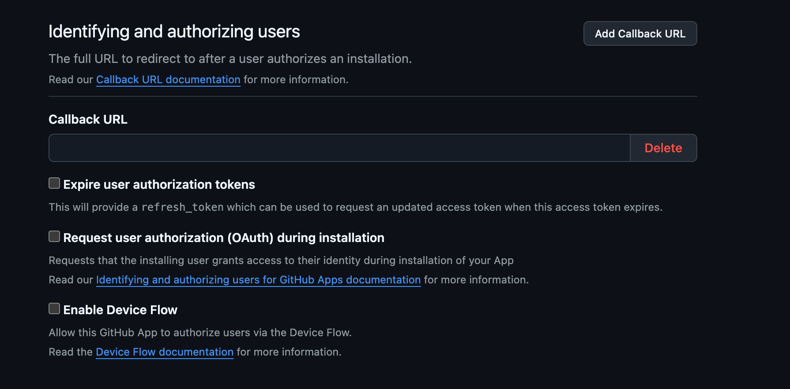
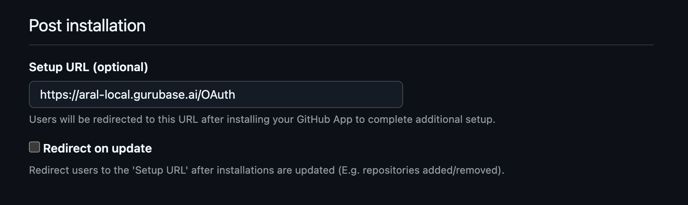
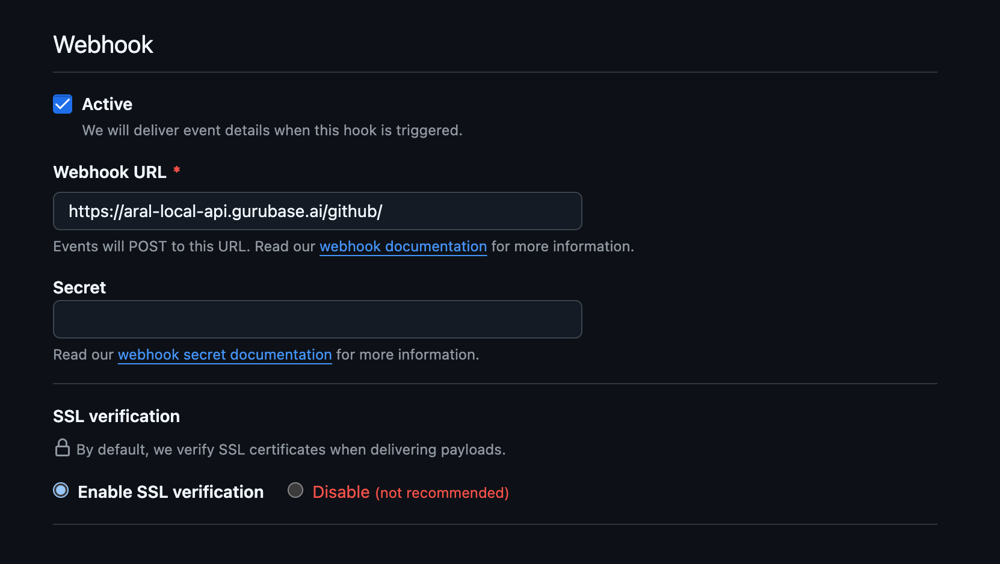
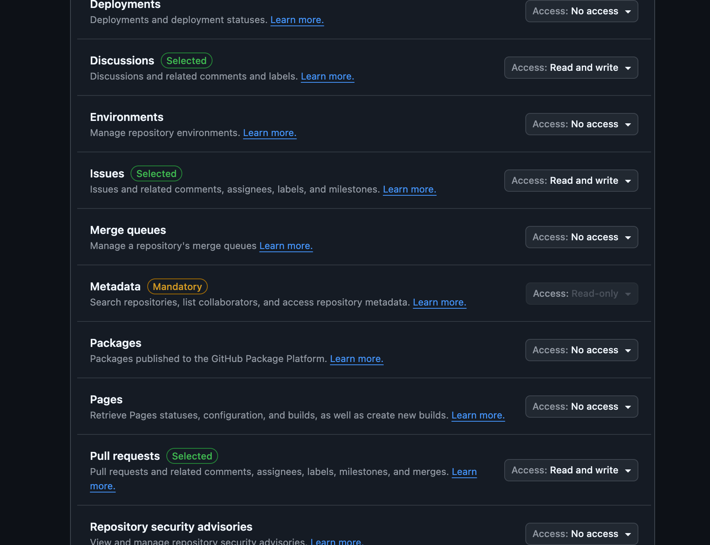
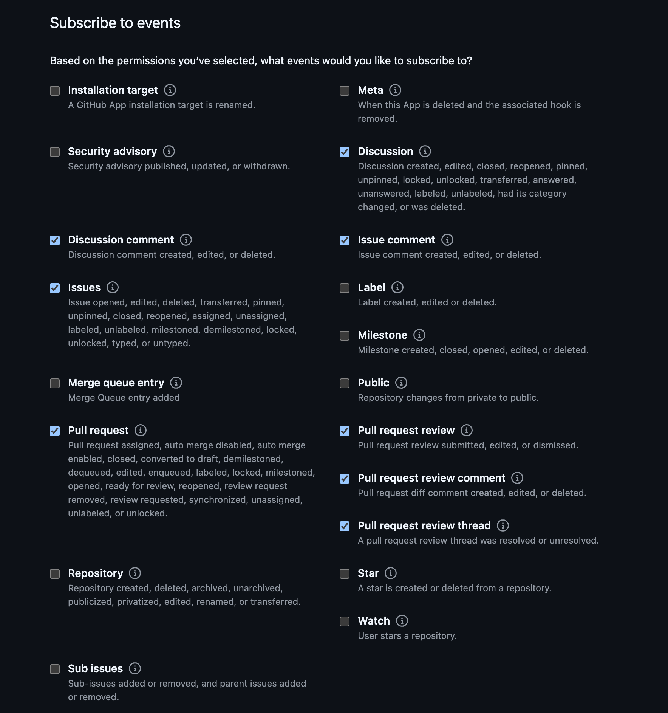
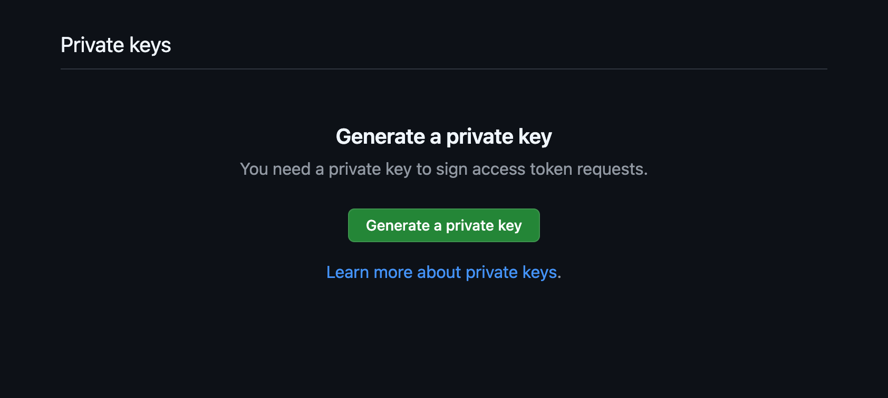

1. Go to https://github.com/settings/apps
2. Click "New GitHub App"
3. Type in the name
4. Type in the description
5. Type in the Homepage URL
6. Leave the Callback URL empty and untick all these checkboxes

7. Under Setup URL (optional), set it to `{frontend_url}/OAuth`.

Example: `https://aral-local.gurubase.ai/OAuth`

8. Keep "Redirect on update" unticked
9. Under "Webhook", make it active
10. Under Webhook URL, set it to `{backend_url}/github/`

Example: `https://aral-local-api.gurubase.ai/github/`

11. Keep Secret empty. (This can be added as a future todo)
12. Keep SSL verification enabled
13. Under permissions, click "Repository permissions"
14. Select "Read and write" for these:
- Discussions (disabled on bot for now)
- Issues
- Pull requests (disabled on bot for now)

> This will enable Metadata as well, keep it

15. Under "Subscribe to events", tick these:
- Discussion
- Discussion comment
- Issues
- Issue comment
- Pull request
- Pull request review
- Pull request review comment
- Pull request review thread

16. In the final section,

- Selfhosted: Keep "Only on this account"
- Cloud: Select "Any account"

17. In the app edit page under "General", copy the "Client ID", and set it as `GITHUB_APP_CLIENT_ID` as a backend env.

18. In the same page, scroll down to "Private keys"

19. Click "Generate a private key". This will download the private key.

19. Rename this private key to `github.pem` and move it under `backend/github`, which is the sibling of `gcp`.

20. Then, click to "Install App". This will take you to

`https://github.com/settings/apps/{app_name}/installations/`

Find your app name from this url, and replace it with this template:

`https://github.com/apps/{app_name}/installations/new/`.

This is your installation url.

21. On frontend, set the `NEXT_PUBLIC_GITHUB_INTEGRATION_URL` to this url.

`NEXT_PUBLIC_GITHUB_INTEGRATION_URL=https://github.com/apps/{app_name}/installations/new/` 

22. Rebuild frontend.

23. You should be ready to connect to the github app from the Gurubase UI.

> [!NOTE]
> The JWT tokens are saved on redis for caching. So if you make any changes on the installation process, make sure you clear the keys in redis before trying the new version.
