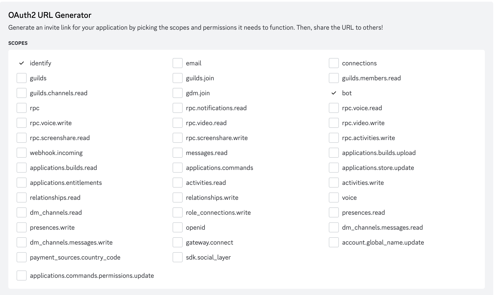
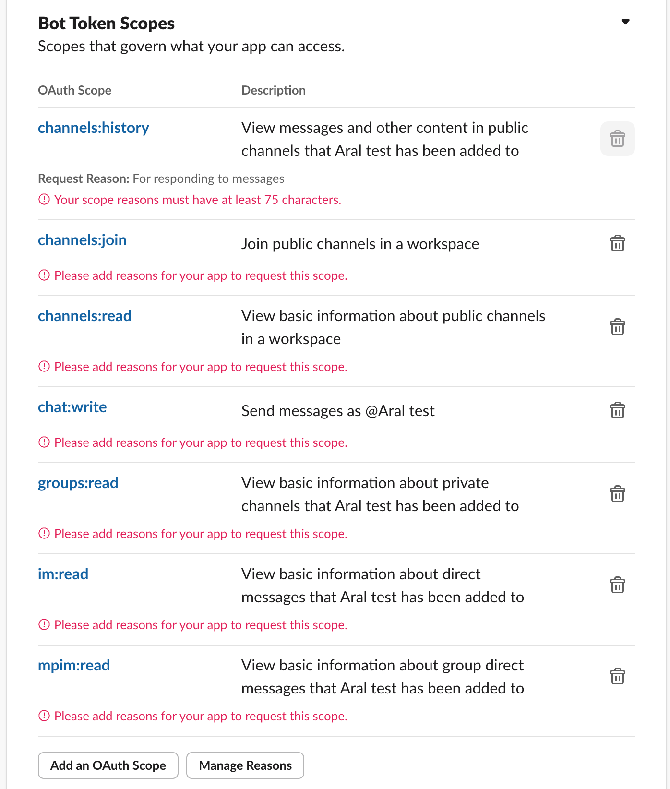

1. First and foremost, set this in backend env
- `PROD_BACKEND_URL`
2. After you receive your OAuth button url, make sure you update it inside `IntegrationContent` component. It is currently hardcoded for local testing env.

```
  const integrationConfig = {
    slack: {
      name: "Slack",
      description:
        "By connecting your account, you can easily share all your posts and invite your friends.",
      iconSize: "w-5 h-5",
      url: `https://slack.com/oauth/v2/authorize?client_id=8327841447732.8318709976774&scope=channels:history,channels:join,channels:read,chat:write,groups:history,im:history,groups:read,mpim:read,im:read&user_scope=channels:history,chat:write,channels:read,groups:read,groups:history,im:history`,
      icon: SlackIcon
    },
    discord: {
      name: "Discord",
      description:
        "Connect your Discord account to share content and interact with your community.",
      bgColor: "bg-[#5865F2]",
      iconSize: "w-5 h-5",
      url: `https://discord.com/oauth2/authorize?client_id=1331218460075757649&permissions=8&response_type=code&redirect_uri=https%3A%2F%2Fe306-34-32-48-186.ngrok-free.app%2FOAuth&integration_type=0&scope=identify+bot`,
      icon: DiscordIcon
    }
  };
```


# Discord

1. Go to https://discord.com/developers/applications
2. Click "New Application" and follow up
3. Go to Bot and set these as backend envs:
    - `DISCORD_BOT_TOKEN`
4. Go to OAuth2 and set these as backend envs:
    - `DISCORD_CLIENT_ID`
    - `DISCORD_CLIENT_SECRET`
5. Add the following to Redirects:
    - `${frontend_url}/OAuth`
6. Then, pick the appropriate scopes and permissions
    - Identify
    - Bot
        - Send Messages

    
    
7. Select your redirect url
    - `${frontend_url}/OAuth`
8. Pick appropriate bot permissions
    - The minimum set is currently untested. You can pick Administrator for now.
9. Pick Guild Install as Integration Type
10. Copy the generated url as the Discord integration button url 


## Envs

- `DISCORD_CLIENT_ID`: Found in OAuth2
- `DISCORD_CLIENT_SECRET`: Found in OAuth2
- `DISCORD_REDIRECT_URI`: `${frontend_url}/OAuth`
- `DISCORD_BOT_TOKEN`: Found in Bot

## Usage
1. Run `discordListener`
    - `python manage.py discordListener`
2. Set it up from frontend
3. Add the channels
4. Mention the bot and ask a question in that channel

# Slack

1. Go to https://api.slack.com/apps
2. Click Create New App
3. Click from scratch
4. Pick a workspace for now
5. Go to Basic Information and set these as backend envs:
    - `SLACK_CLIENT_ID`
    - `SLACK_CLIENT_SECRET`
6. Go to OAuth & Permissions and add this as Redirect URL:
    - `${frontend_url}/OAuth`
7. Go to Event Subscriptions and add this as Request URL:
    - `${backend_url}/slack/events`
8. Go to Intergrations and add this as Redirect URL:
    - `${frontend_url}/OAuth`
9. Go to OAuth & Permissions and add these as Bot and User Token scopes:
    - Bot
        - `channels:history`
        - `channels.join`
        - `channels:read`
        - `chat:write`
        - `groups:read`

    These are the final and minimal scopes
    
10. Then, go to Event Subscriptions
11. Enable it
12. Set this as request url:
    - `${backend_url}/slack/events`
13. Go to Event Subscriptions and add these as Subscribe to bot events:
    - message.channels
14. Go to Manage Distribution
15. Click and confirm "Remove Hard Coded Information"
16. Activate Public Distribution
17. Then, copy the Sharable URL to use it as button url.


## Envs

- `SLACK_CLIENT_ID`: Found in Basic Information
- `SLACK_CLIENT_SECRET`: Found in Basic Information


## Usage
1. Run the backend
2. Set it up from frontend
3. Add the channels
4. Mention the bot and ask a question in that channel
